# SME Voting System: A Blockchain-Based Secure Shareholder Voting Platform with Quadratic Voting

A **Blockchain-Based Secure Shareholder Voting System for Small and Medium Enterprises (SMEs)** that enables transparent, tamper-proof shareholder voting using blockchain technology. This system features **Hybrid Voting Models** supporting both **Simple Weighted Voting** and **Quadratic Voting (QV)** to measure and verify preference intensity.


---

# 1. Introduction

## 1.1. Project Overview

This project presents a **decentralized, blockchain-based e-voting system** designed specifically for shareholder governance in Small and Medium Enterprises (SMEs). The system leverages the immutability and transparency of blockchain technology to ensure that votes cannot be tampered with, while providing a user-friendly web interface for both administrators and shareholders.

The core innovation of this project is the implementation of a **Hybrid Voting Model** that allows administrators to choose between two distinct voting mechanisms on a per-proposal basis:

1.  **Simple Weighted Voting**: The traditional model where voting power is directly proportional to share ownership (1 share = 1 vote).
2.  **Quadratic Voting (QV)**: An advanced mechanism where the *cost* of votes increases quadratically ($Cost = Votes^2$), allowing shareholders to express the *intensity* of their preferences, not just the direction.

## 1.2. Scope of the Project

The scope of this project encompasses the full-stack development of a functional e-voting application, including:

-   **Smart Contract Development**: Writing, testing, and deploying Solidity smart contracts on an Ethereum-compatible blockchain (Hardhat local network for development).
-   **Backend API Development**: Building a RESTful API server using Node.js and Express.js to manage user data, proposals, and votes in a MySQL database, and to interact with the blockchain.
-   **Frontend Development**: Creating a responsive Single Page Application (SPA) using React.js for user interaction, including MetaMask wallet integration for authentication and transaction signing.
-   **Security Implementation**: Incorporating multiple layers of security including nonce-based signature authentication, JWT sessions, rate limiting, and input validation.

## 1.3. Key Contributions

-   A novel, working implementation of **Quadratic Voting** on a blockchain for corporate governance.
-   A **dual-contract architecture** that cleanly separates simple and quadratic voting logic for maintainability and safety.
-   A complete, end-to-end prototype demonstrating the feasibility of decentralized shareholder voting.

---

# 2. Problem Definition

## 2.1. Problem Statement

Traditional shareholder voting in SMEs is often characterized by several critical weaknesses:

1.  **Lack of Transparency**: Voting processes conducted via paper ballots, show of hands, or simple email/form submissions are opaque. Shareholders have no way to independently verify that their vote was counted correctly or that the final tally is accurate.
2.  **Vulnerability to Manipulation**: Centralized voting systems are susceptible to tampering by malicious actors, including those who administer the voting process itself. Votes can be altered, discarded, or fabricated.
3.  **Low Participation & Accessibility**: Requiring physical presence or complex proxy procedures creates friction that discourages shareholder participation, leading to governance decisions being made by a small minority.
4.  **Tyranny of the Majority (in 1-share-1-vote)**: Simple weighted voting allows large shareholders ("whales") to dominate all decisions. A shareholder with 51% of shares can unilaterally dictate outcomes, disenfranchising minority shareholders. There is no mechanism for minorities to express strong preferences on issues critical to them.
5.  **High Administrative Overhead**: Manual vote counting, verification, and auditing are time-consuming, error-prone, and costly.

**This project aims to address these problems by building a transparent, immutable, and fair voting system using blockchain technology and implementing Quadratic Voting to give voice to minority shareholders.**

## 2.2. Background Information & Literature Review

### 2.2.1. Blockchain Technology for Voting

Blockchain, the technology underpinning cryptocurrencies like Bitcoin and Ethereum, offers properties that are highly desirable for voting systems:

| Property | Description | Benefit for Voting |
|---|---|---|
| **Immutability** | Once data is recorded on a blockchain, it is practically impossible to alter or delete. | Votes, once cast, cannot be tampered with. |
| **Transparency** | All transactions are recorded on a public ledger that anyone can inspect. | The vote tally is publicly auditable by any shareholder. |
| **Decentralization** | No single entity controls the network; it is maintained by a distributed network of nodes. | Eliminates a single point of failure or control, reducing the risk of administrative fraud. |
| **Cryptographic Security** | Transactions are secured using public-key cryptography. | Only the legitimate owner of a wallet can cast a vote, ensuring voter authentication. |

Several academic and real-world projects have explored blockchain for voting, including Voatz, Polys, and Follow My Vote. However, most focus on political elections. This project applies the technology specifically to **corporate shareholder governance**, a domain with different requirements and a more controlled participant set.

### 2.2.2. Quadratic Voting (QV)

Quadratic Voting is a collective decision-making mechanism designed by economist E. Glen Weyl, further developed and popularized by him and Eric Posner in their book *Radical Markets* (2018).

**The Core Idea**: In standard voting, each person gets one vote. This treats all issues equally for all people, regardless of how strongly they feel. Quadratic Voting changes this by allowing individuals to "buy" votes using a limited budget of "voice credits." The cost of votes is quadratic:

$$Cost = (Votes)^2$$

| Votes Cast | Token Cost (Cumulative) |
|------------|-------------------------|
| 1          | 1                       |
| 2          | 4                       |
| 3          | 9                       |
| 5          | 25                      |
| 10         | 100                     |

**Why "Quadratic"?** The mathematical property of the quadratic function ($n^2$) ensures that it is expensive to express extreme preferences, but relatively cheap to express mild ones. This incentivizes voters to spread their "credits" across multiple issues they care about mildly, while reserving their strongest expression for the few issues they care about deeply.

**Economic Efficiency**: Weyl and Posner's analysis suggests that QV is more economically efficient than simple majority voting. It better aggregates the *intensities* of preferences, leading to outcomes that maximize total social welfare.

**Prior Implementations**: QV has been piloted by the Colorado State Legislature for budget allocation and used in decentralized autonomous organizations (DAOs) like Gitcoin Grants. This project is one of the first to implement it for traditional SME shareholder governance, bridging the gap between academic theory and practical corporate use.

### 2.2.3. Existing Solutions and Gaps

| Existing Solution | Description | Gap Addressed by This Project |
|---|---|---|
| **Traditional AGMs** | In-person meetings with show-of-hands or paper ballots. | Lack of transparency, accessibility, and immutability. |
| **Email/Online Forms** | Simple digital voting via Google Forms, etc. | No cryptographic security, easily manipulated by admins. |
| **Proprietary E-Voting Platforms** | Commercial SaaS products (e.g., Broadridge). | Expensive, opaque ("black box"), and centralized. |
| **DAO Voting (e.g., Snapshot)** | Blockchain-based voting for DAOs. | Primarily designed for token holders, not traditional shareholders. Often lacks a simple 1-share-1-vote option or the QV hybrid. |

This project fills the gap by providing an **open, auditable, self-hostable system** tailored for SMEs, with the flexibility of choosing between simple and quadratic voting.

---

# 3. Objectives

## 3.1. Primary Objectives

The main goals of this project are:

1.  **To develop a functional, end-to-end blockchain-based e-voting system** for shareholder governance in SMEs.
2.  **To implement a Hybrid Voting Model** that supports both Simple Weighted Voting and Quadratic Voting, selectable on a per-proposal basis.
3.  **To ensure the integrity and immutability of votes** by recording all voting transactions on an Ethereum-compatible blockchain.
4.  **To provide a secure and user-friendly interface** for both administrators (to manage shareholders and proposals) and shareholders (to authenticate and cast votes).
5.  **To demonstrate the practical viability of Quadratic Voting** in a corporate governance context.

## 3.2. Secondary Objectives

Additional goals the project aims to achieve:

1.  **To create a fully documented and reproducible project** that can serve as a reference implementation for future development or academic study.
2.  **To minimize gas costs** for blockchain transactions where possible, making the system economically feasible.
3.  **To ensure backward compatibility** between different system versions, so that introducing new features (like QV) does not break existing functionality (simple voting).
4.  **To implement robust security measures** including nonce-based authentication, JWT sessions, rate limiting, and input validation.
5.  **To provide real-time feedback** to users during the voting process, including transaction status and vote confirmation.

---

# 4. Methodology

## 4.1. Overall Approach

The project follows an **incremental, phase-wise development approach**. The system was built layer by layer, starting from the blockchain smart contracts and moving up to the frontend user interface. Each phase was completed and tested before moving to the next.

This approach is aligned with Agile principles, allowing for iterative improvements and reducing the risk of integrating complex components.

### System Architecture Diagram


**Explanation of Flow**:
1.  Users (Shareholders/Admins) interact with the **React Frontend** in their browser.
2.  For authentication and voting, the frontend communicates with the **MetaMask** browser extension.
3.  Voting transactions are sent from MetaMask directly to the **Hardhat Local Blockchain** node, where the smart contracts (`Voting.sol` or `QuadraticVoting.sol`) execute the logic.
4.  The frontend also communicates with the **Express.js Backend** via API calls for non-blockchain operations (e.g., fetching proposal lists, user data).
5.  The backend uses **Prisma ORM** to interact with the **MySQL Database** for persistent storage.
6.  The backend's **Blockchain Service** (using `ethers.js`) also communicates with the blockchain for server-side operations (like auto-syncing shareholders).

### Quadratic Voting Flow Diagram

```mermaid
sequenceDiagram
    actor User as Shareholder
    participant FE as Frontend
    participant API as Backend API
    participant DB as MySQL DB
    participant BC as Blockchain (QV Contract)

    User->>FE: Open Quadratic Proposal
    FE->>API: GET /proposals/:id/token-balance
    API->>DB: Query VoterTokenBalance
    DB-->>API: {totalTokens: 50, tokensUsed: 9}
    API-->>FE: {remaining: 41, currentVotes: 3}
    FE->>User: Display Token Balance & Slider

    User->>FE: Select 2 More Votes (YES)
    FE->>FE: Calculate Cost: (3+2)² - 3² = 16 tokens

    User->>FE: Confirm Vote
    FE->>MetaMask: Request Sign castQuadraticVote(...)
    MetaMask->>User: Confirm Transaction?
    User->>MetaMask: Approve
    MetaMask->>BC: Submit Transaction
    BC->>BC: Deduct 16 tokens, Add 2 to yesVotes
    BC-->>MetaMask: Tx Hash: 0x...
    MetaMask-->>FE: Success, Tx Hash

    FE->>API: POST /vote {proposalId, txHash, voteCount: 2}
    API->>BC: Verify Tx exists
    API->>DB: Update Vote & VoterTokenBalance
    DB-->>API: Success
    API-->>FE: {success: true, tokensRemaining: 25}
    FE-->>User: "2 Votes Cast Successfully!"
```



## 4.2. Procedures and Timeline (Phases)

The project was executed in the following phases:

| Phase | Description | Key Deliverables |
|-------|-------------|------------------|
| **Phase 0** | Baseline & Setup | Project structure, dev environment, initial documentation. |
| **Phase 1** | Database Schema | Prisma schema with `votingType`, `baseTokens`, `VoterTokenBalance` table. |
| **Phase 2** | Smart Contracts | `Voting.sol` (Simple), `QuadraticVoting.sol` (QV), deployment scripts. |
| **Phase 3** | Backend Services | `QuadraticVotingService`, modifications to `ProposalService`, `VotingService`. |
| **Phase 4** | API Endpoints | New endpoints for token balance, quadratic vote, cost preview. |
| **Phase 5** | Frontend UI | `QuadraticVoteModal`, updated `CreateProposalForm`, conditional rendering. |
| **Phase 6** | Integration Testing | End-to-end tests for simple and quadratic flows. |
| **Phase 7** | Documentation & Finalization | README updates, code cleanup. |

---

# 5. Project Execution

## 5.1. Planning and Design

### 5.1.1. Initial Brainstorming

The project began with identifying the core problems in traditional shareholder voting and evaluating technological solutions. After research, blockchain was selected as the underlying technology due to its transparency and immutability.

### 5.1.2. Design Decisions

Several key architectural decisions were made early in the project:

| Decision | Choice | Rationale |
|----------|--------|-----------|
| **Blockchain Platform** | Ethereum (Hardhat for local dev) | Mature ecosystem, Solidity language, large developer community. MetaMask support is widespread. |
| **Smart Contract Strategy** | Dual-contract (Voting.sol + QuadraticVoting.sol) | Separation of concerns. Avoids modifying a working simple voting contract, reducing risk. |
| **Backend Framework** | Node.js + Express.js | Non-blocking I/O suitable for handling many concurrent users. TypeScript for type safety. |
| **ORM** | Prisma | Modern, type-safe ORM with excellent migration tooling. |
| **Frontend Framework** | React 18 + Vite | Fast development with Hot Module Replacement. Component-based architecture. |
| **Authentication** | MetaMask Nonce Signature + JWT | Cryptographically secure, wallet-based authentication. Eliminates passwords. |
| **Quadratic Cost Model** | $n^2$ total cost | Standard QV model. 3 votes cost 9 tokens total. |
| **Token Pool** | $100 \times \text{share ratio}$ | Simple, proportional allocation based on ownership percentage. |

### 5.1.3. Database Schema Design

The database was designed to support both voting types while maintaining backward compatibility. Key tables include:


## 5.2. Implementation Details

### 5.2.1. Smart Contract Implementation

Two Solidity contracts were developed:

**1. `Voting.sol` (Simple Weighted Voting)**
-   Manages shareholder registration with share counts.
-   Creates time-bound proposals.
-   Allows shareholders to cast a single weighted vote (YES/NO).
-   Prevents double voting via a `hasVoted` mapping.

**2. `QuadraticVoting.sol` (Quadratic Voting)**
-   Manages per-proposal token balances for each voter.
-   Implements the `calculateVoteCost(currentVotes, additionalVotes)` function: $(\text{current} + \text{additional})^2 - \text{current}^2$
-   Allows multiple vote casts (as long as tokens remain and direction is consistent).
-   Locks vote direction after the first vote to prevent gaming.
-   Uses an integer square root function for voting power calculation.

### 5.2.2. Backend Implementation

The backend was built with a service-oriented architecture:

-   **`blockchain.service.ts`**: Low-level interaction with the blockchain using `ethers.js`. Signs transactions, calls contract methods.
-   **`proposal.service.ts`**: Business logic for creating/fetching proposals. Modified to accept `votingType` and `baseTokens`.
-   **`voting.service.ts`**: Handles simple vote casting. Modified to route to `quadratic-voting.service.ts` for QV proposals.
-   **`quadratic-voting.service.ts`**: New service for all QV logic—token calculation, balance management, cost preview, vote casting.
-   **`startup.service.ts`**: Auto-syncs shareholders from DB to blockchain on server start.

### 5.2.3. Frontend Implementation

The frontend uses React functional components with Context API for state management:

-   **`WalletContext`**: Manages MetaMask connection state, active account, and chain ID.
-   **`AuthContext`**: Manages JWT authentication state, user role, and profile.
-   **`VoteModal`**: Original modal for simple YES/NO voting.
-   **`QuadraticVoteModal`**: New modal with a slider to select vote count, real-time cost calculation, and token balance display. Conditionally rendered based on `proposal.votingType`.
-   **`CreateProposalForm`**: Updated with a voting type selector (Simple/Quadratic) and a base token input field.

---

# 6. Tools and Techniques Used

## 6.1. Tools (Software & Hardware)

### 6.1.1. Development Environment

| Tool | Version | Purpose |
|------|---------|---------|
| **Node.js** | v18+ LTS | JavaScript runtime for backend and frontend tooling. |
| **npm** | v8+ | Package management. |
| **VS Code** | Latest | Integrated Development Environment (IDE). |
| **Git** | Latest | Version control. |
| **MySQL Server** | v8.0+ | Relational database for persistent storage. |
| **Postman** | Latest | API testing and debugging. |

### 6.1.2. Blockchain Stack

| Tool | Version | Purpose |
|------|---------|---------|
| **Hardhat** | v2.x | Ethereum development framework for compiling, testing, and deploying Solidity contracts. Provides a local blockchain node for development. |
| **Solidity** | v0.8.20 | Smart contract programming language. |
| **ethers.js** | v6 | JavaScript library for interacting with the Ethereum blockchain. Used in both backend and frontend. |
| **MetaMask** | Browser Ext. | Crypto wallet for user authentication and transaction signing. |

### 6.1.3. Backend Stack

| Tool | Version | Purpose |
|------|---------|---------|
| **Express.js** | v4.x | Minimal, flexible Node.js web application framework for building RESTful APIs. |
| **TypeScript** | v5.x | Typed superset of JavaScript for improved code quality and maintainability. |
| **Prisma** | v5.x | Next-generation ORM for Node.js and TypeScript. Used for database schema management, migrations, and queries. |
| **JSON Web Token (JWT)** | - | Standard for secure authentication tokens. |
| **express-validator** | v7.x | Middleware for input validation and sanitization. |
| **helmet** | v7.x | Security middleware for setting HTTP headers. |

### 6.1.4. Frontend Stack

| Tool | Version | Purpose |
|------|---------|---------|
| **React** | v18.x | JavaScript library for building user interfaces using components. |
| **Vite** | v5.x | Fast frontend build tool and development server with Hot Module Replacement (HMR). |
| **React Router** | v6.x | Declarative routing for React applications. |
| **Axios** | v1.x | Promise-based HTTP client for making API requests. |
| **CSS3** | - | Styling with custom properties (CSS variables) and responsive design. |

## 6.2. Techniques

### 6.2.1. Nonce-Based Signature Authentication

Instead of passwords, users authenticate by signing a unique, server-generated **nonce** (a random number used once) with their MetaMask wallet. The server verifies the signature against the user's public wallet address. This provides cryptographic proof of identity without transmitting any secrets over the network.

**Flow:**
1.  User requests a nonce for their wallet address.
2.  Server generates and stores a random nonce, sends it to the client.
3.  User signs the nonce with MetaMask.
4.  User sends the signature back to the server.
5.  Server recovers the signer's address from the signature. If it matches, the user is authenticated, and a JWT is issued. The nonce is immediately invalidated.

### 6.2.2. Frontend-Signed Transactions

For maximum trustlessness, users sign voting transactions directly in their browser using MetaMask. The transaction is submitted to the blockchain without ever passing through the backend in a modifiable state. The backend only verifies the transaction *after* it has been confirmed on the blockchain.

**Benefit**: This prevents any possibility of the backend administrator manipulating votes, as they never have access to the user's private key or the unsigned transaction.

### 6.2.3. Transaction Queue for Nonce Management

Blockchain transactions require a unique **nonce** (different from the auth nonce) for each transaction from a given wallet. If multiple transactions are submitted concurrently from the same admin wallet, they can conflict. The backend implements a **transaction queue** that ensures transactions are submitted sequentially with correct nonces.

### 6.2.4. Backward-Compatible, Incremental Migration

The database schema was updated using Prisma's migration system. All new fields (`votingType`, `baseTokens`, `tokensSpent`, etc.) were given **default values** (`'simple'`, `100`, `0`), ensuring that existing data remained valid and functional without any manual intervention. This is a standard technique for safe schema evolution.

---

# 7. Results and Discussion

## 7.1. Final Results

The project successfully achieved all primary objectives. A fully functional e-voting system was developed with the following capabilities:

### 7.1.1. Demonstrated Features

| Feature | Status | Notes |
|---------|--------|-------|
| **Shareholder Management** | ✅ Complete | Admin can add/edit/deactivate shareholders. Auto-synced to blockchain. |
| **Proposal Management** | ✅ Complete | Admin can create proposals with Simple or Quadratic voting type. |
| **Simple Voting** | ✅ Complete | Shareholders can cast 1 weighted vote (YES/NO). |
| **Quadratic Voting** | ✅ Complete | Shareholders can cast multiple votes at quadratic cost. |
| **Token Balance Display** | ✅ Complete | QV modal shows remaining tokens and cost preview. |
| **Vote Immutability** | ✅ Complete | All votes recorded on blockchain, tamper-proof. |
| **Wallet Authentication** | ✅ Complete | MetaMask-based, passwordless login. |
| **Real-time Results** | ✅ Complete | Vote tallies update after each vote. |
| **Tie Resolution** | ✅ Complete | Admin can resolve tied proposals with three resolution types. |

### 7.1.2. Tie-Breaking Policy

When a proposal ends with equal YES and NO votes, the system implements an **Admin Tie-Breaking Mechanism** to reach a final decision. This ensures that tied proposals do not remain in limbo indefinitely.

#### Resolution Types

The Admin/Chairperson can resolve a tie using one of three methods:

| Resolution Type | Description | Final Status |
|-----------------|-------------|--------------|
| **STATUS_QUO_REJECT** | Proposal is rejected, maintaining the status quo (default conservative approach) | REJECTED |
| **CHAIRPERSON_YES** | Admin casts the deciding vote in favor of the proposal | APPROVED |
| **CHAIRPERSON_NO** | Admin casts the deciding vote against the proposal | REJECTED |

#### How It Works

1. **Tie Detection**: When voting closes, if `yesVotes == noVotes`, the proposal is marked as tied
2. **Admin Resolution**: Only the admin can resolve the tie by calling `resolveTie(proposalId, resolutionType)`
3. **On-Chain Recording**: The resolution is permanently recorded on the blockchain via the `TieResolved` event
4. **Immutability**: Once resolved, the decision cannot be changed (prevents tampering)

#### Smart Contract Integration

Both `Voting.sol` (simple voting) and `QuadraticVoting.sol` implement identical tie resolution functionality:

```solidity
// Tie resolution storage
mapping(uint256 => string) public tieResolution;

// Event emitted when tie is resolved
event TieResolved(uint256 indexed proposalId, string resolutionType);

// Admin-only function to resolve ties
function resolveTie(uint256 _proposalId, string memory _type) external onlyAdmin {
    require(!proposals[_proposalId].votingOpen, "Voting must be closed to resolve tie");
    require(proposals[_proposalId].yesVotes == proposals[_proposalId].noVotes, "Proposal is not tied");
    require(bytes(tieResolution[_proposalId]).length == 0, "Tie already resolved");
    require(
        keccak256(bytes(_type)) == keccak256(bytes("STATUS_QUO_REJECT")) ||
        keccak256(bytes(_type)) == keccak256(bytes("CHAIRPERSON_YES")) ||
        keccak256(bytes(_type)) == keccak256(bytes("CHAIRPERSON_NO")),
        "Invalid resolution type"
    );
    
    tieResolution[_proposalId] = _type;
    emit TieResolved(_proposalId, _type);
}

// Query tie resolution
function getTieResolution(uint256 _proposalId) external view returns (string memory) {
    return tieResolution[_proposalId];
}
```

#### Example Scenario

**Proposal:** "Should we expand to a new office?"
- **YES Votes:** 50 shares (from 2 shareholders)
- **NO Votes:** 50 shares (from 2 other shareholders)
- **Result:** TIE (50-50)

**Admin Decision:** After discussion with the board, the admin decides to maintain the status quo:
```bash
# Admin calls smart contract
resolveTie(proposalId: 1, resolutionType: "STATUS_QUO_REJECT")

# Blockchain emits event
TieResolved(proposalId: 1, resolutionType: "STATUS_QUO_REJECT")

# Final result: Proposal REJECTED
```

#### Validation Rules

| Rule | Description | Error Message |
|------|-------------|---------------|
| ✅ Voting must be closed | Cannot resolve while voting is still open | "Voting must be closed to resolve tie" |
| ✅ Must be actual tie | yesVotes must equal noVotes | "Proposal is not tied" |
| ✅ Valid resolution type | Only 3 types allowed | "Invalid resolution type" |
| ✅ Admin-only | Non-admins cannot resolve | "Only admin can call this function" |
| ✅ One-time resolution | Cannot change resolution after it's set | "Tie already resolved" |

#### Test Coverage

The tie resolution functionality is thoroughly tested with **28 test cases** covering:
- ✅ All three resolution types (STATUS_QUO_REJECT, CHAIRPERSON_YES, CHAIRPERSON_NO)
- ✅ Admin-only access control
- ✅ Premature resolution prevention
- ✅ Non-tied proposal rejection
- ✅ Double resolution prevention
- ✅ Invalid resolution type rejection
- ✅ 0-0 ties (no votes cast)
- ✅ Complex multi-voter tie scenarios
- ✅ Both Simple and Quadratic voting types

**Test Results:** 144/144 tests passing ✅

### 7.1.3. Test Scenario: Quadratic Voting in Action

A test was conducted with 3 shareholders voting on a Quadratic proposal with a BasePool of 100 tokens:

| Shareholder | Shares | Token Allocation | Votes Cast (YES) | Tokens Spent | Voting Power |
|-------------|--------|------------------|------------------|--------------|--------------|
| Alice       | 500    | 50               | 7                | 49           | 7.0          |
| Bob         | 300    | 30               | 5                | 25           | 5.0          |
| Charlie     | 200    | 20               | 4                | 16           | 4.0          |
| **Total**   | 1000   | 100              | **16 YES**       | 90           | **16.0**     |

**Analysis**: In simple voting, Alice (with 50% shares) would have dominated. In QV, while Alice still has the most power, her marginal cost for each additional vote is higher. Charlie, despite having only 20% of shares, still contributes meaningfully (4 out of 16 total voting power = 25%). This demonstrates QV's ability to dampen whale dominance and give voice to minorities.

## 7.2. Discussion

### 7.2.1. Objectives Met

| Objective | Met? | Evidence |
|-----------|------|----------|
| Functional e-voting system | ✅ | System runs end-to-end in local dev. |
| Hybrid Voting Model (Simple + QV) | ✅ | Admin can select voting type at proposal creation. |
| Immutable votes on blockchain | ✅ | Votes verifiable on Hardhat Network logs. |
| Secure, user-friendly interface | ✅ | Toast notifications, loading states, MetaMask integration. |
| Practical viability of QV | ✅ | Test scenario demonstrates QV mechanics work correctly. |

### 7.2.2. Significance of Findings

This project demonstrates that Quadratic Voting, a concept primarily discussed in academic economics literature, can be practically implemented in a real software system intended for corporate governance. The dual-contract architecture proved effective in isolating QV complexity from the simpler, already-working voting logic.

### 7.2.3. Limitations and Future Work

| Limitation | Description | Potential Solution |
|------------|-------------|--------------------|
| **Local Network Only** | Currently runs on Hardhat's local blockchain. | Deploy to a public testnet (e.g., Sepolia) or mainnet. |
| **Gas Costs** | Each vote is a blockchain transaction with gas fees. | Optimize contracts, or use Layer 2 solutions (e.g., Polygon, Arbitrum). |
| **Single Direction Lock** | Voters cannot split votes between YES and NO in QV. | This is a design choice, but could be made configurable. |
| **No Vote Delegation** | Shareholders cannot delegate their votes to a proxy. | Add a delegation feature in a future version. |
| **No Privacy** | Votes are publicly visible on the blockchain. | Implement zero-knowledge proofs (ZKPs) for anonymous voting. |

---

# 8. Prototype (Software)

## 8.1. Prototype Description

The developed prototype is a **full-stack web application** consisting of three main modules:

### 8.1.1. Smart Contracts Module (`smart-contracts/`)

-   **`Voting.sol`**: Handles simple weighted voting.
-   **`QuadraticVoting.sol`**: Handles quadratic voting with token management.
-   **Deployment Scripts**: Automate contract deployment to the Hardhat network.
-   **Test Suite**: Hardhat tests verifying contract logic.

### 8.1.2. Backend Module (`backend/`)

-   **RESTful API**: 20+ endpoints for auth, shareholders, proposals, voting, and results.
-   **Database**: MySQL with Prisma ORM for schema management.
-   **Auto-Sync**: On startup, syncs all shareholders to the blockchain and funds their wallets.

### 8.1.3. Frontend Module (`frontend/`)

-   **Login Page**: Connect wallet, sign nonce, receive JWT.
-   **Admin Dashboard**: View stats, manage shareholders, create proposals (Simple or Quadratic), view results.
-   **Shareholder Dashboard**: View active proposals, cast votes (Simple or Quadratic modal), view voting history.

### 8.1.4. UI Screenshots (Conceptual)

*(Note: Replace with actual screenshots if available)*

| Screen | Description |
|--------|-------------|
| **Login** | MetaMask connect button, "Sign Message" prompt. |
| **Admin - Create Proposal** | Form with title, description, dates, and a toggle for "Simple" vs "Quadratic" voting type. |
| **Shareholder - Quadratic Vote Modal** | Shows token balance, vote direction selector (locked after first vote), a slider to choose vote count, real-time cost breakdown, and a "Cast Votes" button. |
| **Results Page** | Bar chart showing YES vs NO votes, list of individual votes (wallet, weight, timestamp). |

## 8.2. Development Process

### 8.2.1. Challenges Faced and Solutions

| Challenge | Solution |
|-----------|----------|
| **Nonce conflicts on concurrent backend transactions** | Implemented a transaction queue that serializes blockchain writes. |
| **Backward compatibility when adding QV** | Used default values for all new DB fields (`votingType='simple'`, `tokensSpent=0`). Existing simple voting path was not modified, only new code paths were added. |
| **Calculating integer square root in Solidity** | Implemented the Babylonian method for efficient, gas-optimized integer sqrt. |
| **Preventing users from gaming QV by voting both YES and NO** | Added `voteDirection` lock: once a user casts their first vote, their direction is fixed for that proposal. |

## 8.3. Testing and Validation

### 8.3.1. Unit Testing

-   **Smart Contracts**: Tested using Hardhat's testing framework (Mocha + Chai). Tests cover proposal creation, vote casting, double-vote prevention, and edge cases.
-   **Backend**: (Conceptual - can be expanded) Services can be unit-tested using Jest with mocked Prisma and blockchain clients.

### 8.3.2. Integration Testing

End-to-end tests were performed manually:

1.  **Simple Voting Flow**: Create simple proposal → Shareholder votes YES → Verify on-chain `yesVotes` increased by share weight.
2.  **Quadratic Voting Flow**: Create QV proposal → Initialize tokens → Shareholder casts 3 votes → Verify 9 tokens deducted, `yesVotes` increased by 3. → Cast 2 more votes → Verify cost is $(3+2)^2 - 3^2 = 16$ tokens, total `yesVotes` is 5.
3.  **Backward Compatibility**: Create proposal using old API format (no `votingType`) → Verify defaults to `'simple'` → Vote using old API format → Works correctly.

### 8.3.3. Verification Commands

```bash
# Run smart contract tests
cd sme-voting-system/smart-contracts
npx hardhat test

# Verify blockchain sync
cd sme-voting-system/backend
npm run db:verify-blockchain
```

---

# 9. Conclusion

## 9.1. Summary

This project successfully designed, developed, and demonstrated a **Blockchain-Based Secure Shareholder Voting System** tailored for SMEs. The key achievements are:

1.  **A complete, working prototype** spanning smart contracts, a Node.js backend, and a React frontend.
2.  **A Hybrid Voting Model** that supports both traditional Simple Weighted Voting and innovative Quadratic Voting.
3.  **Transparent and immutable vote recording** on an Ethereum-compatible blockchain.
4.  **Secure, passwordless authentication** using MetaMask wallet signatures.
5.  **A demonstration of Quadratic Voting's potential** to create fairer governance by dampening whale dominance and allowing minority shareholders to express strong preferences.

The project addresses the core problems of traditional shareholder voting—opacity, vulnerability to manipulation, and the tyranny of the majority—by leveraging the inherent properties of blockchain technology and modern voting theory.

## 9.2. Future Scope

-   Deployment to a public Ethereum testnet (Sepolia) or mainnet.
-   Implementation of **vote delegation** (proxy voting).
-   Exploration of **zero-knowledge proofs (ZKPs)** for anonymous voting.
-   Development of a **mobile application** for greater accessibility.
-   Integration with **ENS (Ethereum Name Service)** for human-readable wallet addresses.

## 9.3. Personal Reflection *(Template for Team Members)*

*(Each team member should write a brief reflection here)*

> **[Student Name]**: *"Working on this project gave me hands-on experience with blockchain development, from writing Solidity smart contracts to integrating them with a full-stack web application. The most challenging part was implementing Quadratic Voting from the academic theory to working code, but it was also the most rewarding. I now have a much deeper understanding of decentralized systems and their potential for transforming traditional processes like voting."*

---

# Appendix: Technical Reference

## A. Tech Stack Summary

| Layer | Technology |
|-------|------------|
| **Smart Contracts** | Solidity 0.8.20, Hardhat |
| **Backend** | Node.js, Express.js, TypeScript |
| **Database** | MySQL with Prisma ORM |
| **Blockchain Integration** | ethers.js v6 |
| **Authentication** | MetaMask + JWT (Nonce-based signature) |
| **Frontend** | React 18 + Vite + TypeScript |
| **Routing** | React Router v6 |
| **HTTP Client** | Axios |

## B. Project Structure

```
sme-voting-system/
├── smart-contracts/          # Solidity contracts + Hardhat
│   ├── contracts/
│   │   ├── Voting.sol            # Simple voting contract
│   │   ├── QuadraticVoting.sol   # Quadratic voting contract
│   │   └── ShareholderVoting.sol
│   ├── scripts/
│   │   ├── deploy.js         # Contract deployment
│   │   ├── check-admin.js    # Admin verification script
│   │   └── fund-wallets.js   # Wallet funding utility
│   ├── test/                 # Contract tests
│   └── hardhat.config.js
│
├── backend/                  # Node.js + Express API
│   ├── prisma/
│   │   ├── schema.prisma     # Database schema
│   │   ├── seed.ts           # Database seeding
│   │   ├── sync-to-blockchain.ts  # Manual sync utility
│   │   └── verify-blockchain.ts   # Verification utility
│   └── src/
│       ├── index.ts          # Express server entry
│       ├── config/           # Configuration management
│       ├── contracts/        # Smart contract ABIs
│       ├── controllers/      # Request handlers
│       ├── middleware/       # Auth, validation, security
│       ├── routes/           # API route definitions
│       ├── services/         # Business logic
│       │   ├── blockchain.service.ts    # Smart contract interactions
│       │   ├── proposal.service.ts
│       │   ├── voting.service.ts
│       │   ├── quadratic-voting.service.ts  # NEW
│       │   └── startup.service.ts       # Auto-sync on startup
│       └── utils/            # Utility functions
│
├── frontend/                 # React + Vite SPA
│   └── src/
│       ├── components/       # Reusable components
│       │   ├── ui/           # UI primitives (Toast, Loading, Forms)
│       │   ├── Navbar.tsx
│       │   ├── ProposalCard.tsx
│       │   ├── VoteModal.tsx
│       │   ├── QuadraticVoteModal.tsx  # NEW
│       │   └── ...
│       ├── pages/            # Page components
│       │   ├── Home.tsx
│       │   ├── Login.tsx
│       │   ├── AdminDashboard.tsx
│       │   ├── ShareholderDashboard.tsx
│       │   └── ProposalDetail.tsx
│       ├── context/          # React Context providers
│       │   ├── WalletContext.tsx
│       │   └── AuthContext.tsx
│       ├── services/         # API service layer
│       ├── styles/           # CSS styling
│       └── contracts/        # Contract ABIs (frontend)
│
└── README.md
```

## C. Database Schema

| Table | Description | Key Fields |
|-------|-------------|------------|
| `shareholders` | Shareholder records | wallet_address, name, email, is_admin, is_active |
| `shares` | Share ownership | shareholder_id, shares |
| `proposals` | Voting proposals | id, title, voting_type, base_tokens, start_time, end_time |
| `votes` | Vote records | shareholder_id, proposal_id, vote_choice, vote_weight, tokens_spent |
| `voter_token_balances` | QV Token Tracking | shareholder_id, proposal_id, total_tokens, tokens_used, vote_direction |
| `auth_nonces` | Authentication nonces | wallet_address, nonce, expires_at |

## D. API Endpoints

### Authentication
| Method | Endpoint | Auth | Description |
|--------|----------|------|-------------|
| POST | `/auth/nonce` | ❌ | Request authentication nonce |
| POST | `/auth/verify` | ❌ | Verify signature & get JWT |
| GET | `/auth/me` | ✅ | Get current user info |

### Shareholders
| Method | Endpoint | Auth | Description |
|--------|----------|------|-------------|
| GET | `/shareholders` | ✅ | List all shareholders |
| POST | `/shareholders/register` | 🔒 Admin | Register new shareholder |
| GET | `/shareholders/:walletAddress` | ✅ | Get shareholder details |
| PUT | `/shareholders/:walletAddress/shares` | 🔒 Admin | Update shares |
| DELETE | `/shareholders/:walletAddress` | 🔒 Admin | Deactivate shareholder |
| GET | `/shareholders/stats/total-shares` | ✅ | Get total shares |

### Proposals
| Method | Endpoint | Auth | Description |
|--------|----------|------|-------------|
| GET | `/proposals` | ✅ | List all proposals |
| POST | `/proposals/create` | 🔒 Admin | Create new proposal (with `votingType`, `baseTokens`) |
| GET | `/proposals/:proposalId` | ✅ | Get proposal details |
| GET | `/proposals/:proposalId/token-balance` | ✅ | Get voter's token balance (QV) |
| DELETE | `/proposals/:proposalId` | 🔒 Admin | Deactivate proposal |

### Voting
| Method | Endpoint | Auth | Description |
|--------|----------|------|-------------|
| POST | `/vote` | ✅ | Cast a vote (Simple or QV) |
| POST | `/vote/quadratic` | ✅ | Cast a quadratic vote |
| GET | `/vote/cost-preview` | ✅ | Preview cost for N votes (QV) |
| GET | `/vote/my-votes` | ✅ | Get user's votes |
| GET | `/vote/check/:proposalId` | ✅ | Check if voted |
| GET | `/vote/proposal/:proposalId` | 🔒 Admin | Get all votes for proposal |

### Results
| Method | Endpoint | Auth | Description |
|--------|----------|------|-------------|
| GET | `/results/:proposalId` | ✅ | Get voting results |

**Legend:** ❌ No auth | ✅ JWT required | 🔒 Admin only

## E. Getting Started

### Prerequisites
- **Node.js** (v18+ LTS)
- **npm** (v8+)
- **MySQL Server** (v8.0+)
- **MetaMask** browser extension
- **Git**

### Installation
```bash
# Clone the repository
git clone https://github.com/saarthibhatia12/evoting-for-sme-using-blockchain.git
cd evoting-for-sme-using-blockchain/sme-voting-system

# Install all dependencies
npm install
```

### Running the Project

**🚨 IMPORTANT: Run in this exact order!**

#### Terminal 1: Start Hardhat Blockchain Node
```bash
cd sme-voting-system/smart-contracts
npx hardhat node
```
*(Keep this running)*

#### Terminal 2: Deploy Smart Contract
```bash
cd sme-voting-system/smart-contracts
npx hardhat run scripts/deploy.js --network localhost
```
*(Copy the `CONTRACT_ADDRESS` to your `.env` files)*

#### Terminal 3: Start Backend Server
```bash
cd sme-voting-system/backend
npm run dev
```
*(Auto-syncs shareholders to blockchain on startup)*

#### Terminal 4: Start Frontend
```bash
cd sme-voting-system/frontend
npm run dev
```
*(Access at http://localhost:5173)*

---

## F. References

1.  Weyl, E. G., & Posner, E. A. (2018). *Radical Markets: Uprooting Capitalism and Democracy for a Just Society*. Princeton University Press.
2.  Ethereum Foundation. *Solidity Documentation*. https://docs.soliditylang.org/
3.  Hardhat Team. *Hardhat Documentation*. https://hardhat.org/docs
4.  Prisma Technologies. *Prisma Documentation*. https://www.prisma.io/docs
5.  Gitcoin. *Quadratic Funding*. https://wtfisqf.com/

---

**Built with ❤️ for transparent and fair shareholder governance**

*Version: 2.0.0 (with Quadratic Voting) | Last Updated: January 2026*
